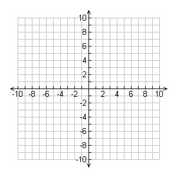

title: CSS Flexbox
subtitle: Boxes that flex
theme: league

## CSS Flexbox

The second layout tool in our CSS toolbox: Flexbox! It is a great tool to couple with CSS Grid to make sure that your content will look good on any device and with absolute ease. (At least compared to how this business used to get done. Which is bad. Very bad.) Flexbox is a very powerful tool and can actually be used to build out page layouts on its own. Hopefully by the end, though, it will become clear when to use grid and when to use flexbox. Let's get started.

## Containers again!

Rejoice! It's our friend the container again! This time we make it a flex container:

```html
<!DOCTYPE html>
<html lang="en">
<head>
    <meta charset="UTF-8">
    <meta name="viewport" content="width=device-width, initial-scale=1.0">
    <meta http-equiv="X-UA-Compatible" content="ie=edge">
    <title>Flexbox Example</title>

    <link rel="stylesheet" href="./layout.css">
    <link rel="stylesheet" href="./style.css">
</head>
<body>
    <div class="container">
        <!-- Again, your content goes here -->
    </div>
</body>
</html>
```
```css
.container {
    display: flex;
}
```

## Flex Container and Flex Items

So there are two MAJOR pieces of vocabulary we need to understand before moving forward because we are going to reference them a lot.

<div class="fragment">
    <h3>Flex Container</h3>

    <p>The first thing we need if we are going to use flexbox is a flex container. In our example, our flex container is the div with the class <code>container</code>. (This is a fairly common practice btw so get used to it and try to start using it on your own) Setting the display to flex lets your code know that anything inside of this containing element should be treated with flexbox rules</p>
</div>

<div class="fragment">
    <h3>Flex Item</h3>

    <p>Now where would we be without some content to manipulate with this amazing tool. The direct children of the flex container are known as the flex items. This is the content that we are actually going to be manipulating. This is also why it's important to house your content in appropriate <code>section</code> tags. We are going to be affecting almost every element in our code with CSS so organize it.</p>
</div>

## The Axes

### This:


<div class="fragment">
    <h3>Not this:</h3>
    
</div>

!SLIDE

Flex item placement is based on two axes. The main-axis and the cross-axis.

### Main-axis
The main-axis is the flex line that your content is placed on. By default the main-axis goes from left to right.

### Cross-axis
The cross-axis is situated perpendicular to the main-axis. This axis is used to distribute your content in the opposite direction of your main-axis.

These two work together as a sort of binary placement system. Think (x, y) coordinates on a graph. But these coordinates can be dynamic. This is what makes flexbox so powerful.

!SLIDE

Let's get some content inside of our document to play with:

```html
<div class="container">
    <div class="flexItem flexItem--1">flex item 1</div>
    <div class="flexItem flexItem--2">flex item 2</div>
    <div class="flexItem flexItem--3">flex item 3</div>
    <div class="flexItem flexItem--4">flex item 4</div>
    <div class="flexItem flexItem--5">flex item 5</div>
</div>
```
```css
.container {
    display: flex;
    margin: 2rem auto;
    padding: 11px;
    max-width: 1000px;
}
.flexItem {
    margin-left: 5px;
    padding: 11px;
}
.flexItem:first-child {
    margin: 0;
}
```

## Flex vs Inline-flex

### Flex
So the first thing to notice is that `display: flex;` renders your container as a block level element. Most of the time, this is going to be what you want most of the time because you'll want your container to fill the entirety of the space it occupies.


!SLIDE

### Inline-flex
If, for some reason, you want your container to be viewed as an inline level element, you can use `display: inline-flex;` instead of just flex. You'll notice that our `auto` margins collapse when we do this because, as an inline level element, there is no extra space around our element.


## Flex Direction

One of the first advantages that you'll notice about flexbox is the ability to change the flow of your content from horizontal to vertical.

Before flexbox this was not as easy as it may seem. Sure you could change the display of the elements to inline or block based on your needs but this always came with unexpected consequences, things that needed to be worked around, unnecessary containers, etc. Flexbox mitigates all of the nonsense for you. All you need to do to change orientation in flexbox is to change one line of code: `flex-direction`. Let's see it in action.

!SLIDE

So let's have a reminder of what we're looking at currently:


The default value of flex direction is row. There are three other options. Let's check them out.

!SLIDE

The next value to discuss is `row-reverse`:

<pre><code class="language-css" data-noescape>
.container {
    display: flex;
    <mark>flex-direction: row-reverse;</mark>
    margin: 2rem auto;
    padding: 11px;
    max-width: 1000px;
}
</code></pre>

!SLIDE

Which gives us:


!SLIDE

Next we're going to get into `column`:

<pre><code class="language-css" data-noescape>
.container {
    display: flex;
    <mark>flex-direction: column;</mark>
    margin: 2rem auto;
    padding: 11px;
    max-width: 1000px;
}
</code></pre>

!SLIDE

You'll notice when we give our container `flex-direction: column` that our main-axis and cross-axis actually switch places. This makes your content flow vertically beginning at the top:


!SLIDE

Finally, we're going see what happens with `column-reverse`:

<pre><code class="language-css" data-noescape>
.container {
    display: flex;
    <mark>flex-direction: column-reverse;</mark>
    margin: 2rem auto;
    padding: 11px;
    max-width: 1000px;
}
</code></pre>

!SLIDE

For our final `flex-direction`, we see that the content behaves similar to how `row-reverse` behaves only in a new orientation:


!SLIDE

As you can see, flexbox has a wide range of options when it comes to the orientation of your content. The power lies in how little code you have to write to get your content to behave this way.

## Flex Wrap

One of the first issues to deal with is wrapping content. You'll notice if you compress your window, your flex items just squish together on the same line:

<div class="fragment">
    
</div>

!SLIDE

We can fix this with another simple addition to our flexbox rules:

<pre><code class="language-css" data-noescape>
.container {
    display: flex;
    flex-direction: row;
    <mark>flex-wrap: wrap;</mark>
    margin: 2rem auto;
    padding: 11px;
    max-width: 1000px;
}
</code></pre>

!SLIDE

Now whenever our container is too narrow for our content to fit in one line, it will split onto as many lines as it needs to display properly.

<div class="fragment">
    
</div>

<div class="fragment">
    <p>Other options are `nowrap` and `wrap-reverse`. Play around with both to see their functionality.</p>
</div>

## Order

Another really powerful aspect of flexbox is the `order` property. So we can give numerical values to individual elements and change their order.

The default order value given to elements is 0. This is why they're placed in the order they appear in your HTML. But if we wanted to have `flex item 4` at the front, we can simply give it an order value less than 0:

```css
.flexItem--4 {
    order: -1;
}
```

!SLIDE

Notice how `flex item 4` is now at the front of our list as opposed to the fourth slot, where it falls in our HTML layout:

<div class="fragment">
    
</div>

<div class="fragment">
    <p>This is super valuable because we can leave our HTML semantically marked up and order things how we want them using CSS. This is the way things should be.</p>
</div>

## Justify Content

So what good is all of this without being able to distribute your content the way you want? Exactly, worthless. So let's jump into the magic of `justify-content`. The default value of `justify-content` is `flex-start`. This is what you've seen so far:

<div class="fragment">
    
</div>

<div class="fragment">
    <p>Notice how the content is flush with the left side or start of the container.</p>
</div>

!SLIDE

The next value for `justify-content` is similar to the first. The value is `flex-end` and it does exactly what you'd expect:

<div class="fragment">
    
</div>

<div class="fragment">
    <p>All items are now aligned to the right side of the container.</p>
</div>

!SLIDE

A really useful value for `justify-content` is `center`. It's not only one of the most used values for `justify-content` but one of the big reasons to use the property at all. We'll get to why this is such a powerful value in future slides:

<div class="fragment">
    
</div>

<div class="fragment">
    <p>This takes all content that you have inside of your container and centers it for you. On it's own it looks like you could easily do this with <code>text-align: center;</code>, and you'd be right. The real power here comes from a pairing with another property.</p>
</div>

!SLIDE

The next value we're going to discuss is `space-between`. This is a really interesting value because it's functionality hasn't even remotely existed in CSS until now. `space-between` takes all space remaining outside of your content and distributes it evenly between each element. Like so:

<div class="fragment">
    
</div>

<div class="fragment">
    <p>This is really useful for distributing things like navigation items.</p>
</div>

!SLIDE

The final value we're going to talk about is `space-around`. This value behaves similarly to `space-between` but instead places excess space on either side of each item. Like so:

<div class="fragment">
    
</div>

<div class="fragment">
    <p>This is really useful for times that you need to distribute extra space evenly and not have the first or last item be flush to the side of your container.</p>
</div>

!SLIDE

So to recap, all values for justify-content are:

```css
.some-containing-element {
    /* Note: you cannot use the 'or' pipes
    ** in the declaration. They're just there
    ** to denote possible options
    **/
    justify-content: flex-start || flex-end ||
        center || space-between || space-around;
}
```

## Align Items

This is where distributing items gets REALLY interesting (and way easier). The `align-items` property is very similar to `justify-content` except it handles distribution of items along the cross-axis instead of the main-axis. To see this in action, let's add some height to our container and check out the default value, `stretch`:

<pre><code class="language-css" data-noescape>
.container {
    display: flex;
    flex-direction: row;
    flex-wrap: wrap;
    <mark>height: 20rem;</mark>
    justify-content: space-around;
    margin: 2rem auto;
    padding: 11px;
    max-width: 1000px;
}
</code></pre>

!SLIDE

As it's name implies, `stretch` stretches all elements to take up all space available on the cross axis:

<div class="fragment">
    
</div>

<div class="fragment">
    <p>Sometimes this is very useful, other times, it's a nuisance. Luckily we have other values to choose from.</p>
</div>

!SLIDE

Our next stop on the `align-items` value trail is one we've seen already, `flex-start`! It does a very similar job here:

<div class="fragment">
    
</div>

<div class="fragment">
    <p>This is good for aligning everything to the top of your container.</p>
</div>

!SLIDE

It would logically follow, then, that `align-items` also has a `flex-end` value. It very does:

<div class="fragment">
    
</div>

<div class="fragment">
    <p>Again, this performs very similarly to <code>flex-start</code> but aligns items to the bottom or end of the container.</p>
</div>

!SLIDE

And now, the moment you've had no idea you'd been waiting for. `align-items` has a `center` value! You should be freaking out about this but you probably have no idea the horrors that were trying to vertically center something without this amazing tool.

<div class="fragment">
    
</div>

<div class="fragment">
    <p>This is SO amazing. Centering in CSS was truly the stuff of nightmares for the frontend developer until flexbox. What's even more amazing is when you pair it with `justify-content: center;`. LET'S DO THAT!</p>
</div>

!SLIDE

<pre><code class="language-css" data-noescape>
.container {
    <mark>align-items: center;</mark>
    display: flex;
    flex-direction: row;
    flex-wrap: wrap;
    height: 20rem;
    <mark>justify-content: center;</mark>
    margin: 2rem auto;
    padding: 11px;
    max-width: 1000px;
}
</code></pre>

!SLIDE

Which gives us:


Content.👏 Aligned.👏 To.👏 The.👏 Center.👏 Of.👏 A.👏 Container.👏

!SLIDE


<div class="fragment">
    <p>Commence to losing your mind. I'll wait...</p>
</div>

## Align Self

Related to `align-items` but not totally is a property that can go on individual items called `align-self`. This allows you to have the functionality of `align-items` but with individual items. Let's try is on item 2:

```css
.flexItem--2 {
    align-self: stretch;
}
```

!SLIDE

This yields the result:


This way you can pretty much put things where ever you want them to be.

!SLIDE


## Flex Grow

There is a property on flex items called `flex-grow`. This property has a default value of 0. But when applied to items in your flex container, it makes each item take up a certain amount of remaining space in the container. Let's apply of 1 to all of our items and see how it goes.

```css
.flexItem {
    flex-grow: 1;
    margin: 5px;
    padding: 11px;
}
```

!SLIDE

Notice how all elements are taking up all available space (minus margins) in the container.


Let's change the `flex-grow` property of item 3 and see how it's affacted.

!SLIDE

```css
.flexItem--3 {
    flex-grow: 5;
}
```

Item 3 has a `flex-grow` value of 5 and the other 4 elements have a `flex-grow` value of one for a total of 9 units.

!SLIDE

Notice how item 3 appears larger now.


## Flex Basis

Now on to `flex-basis`. This allows each item with the property applied to have a width that it must have. That is to say items cannot shrink smaller than their `flex-basis`. Let's apply this with a value of `350px` to item 4 and see the result.

!SLIDE

Notice how when the container is compressed item four will not have a width lower than `350px`


## Now For Practice!

Clone the repository found [here](https://github.com/donhamiltoniii/flexbox-practice-exercise) and follow the instructions in the README.md to complete the assignment. When you finish up, take a look at [Flexbox Zombies](http://flexboxzombies.com) for some in-depth practice with flexbox.

### Other Resources
- [The Ultimate Guide to Flexbox–Learning Through Examples](https://medium.freecodecamp.org/the-ultimate-guide-to-flexbox-learning-through-examples-8c90248d4676)
- [Flexbox Zombies](https://flexboxzombies.com/p/flexbox-zombies)
- [A Complete Guide to Flexbox](https://css-tricks.com/snippets/css/a-guide-to-flexbox/)
