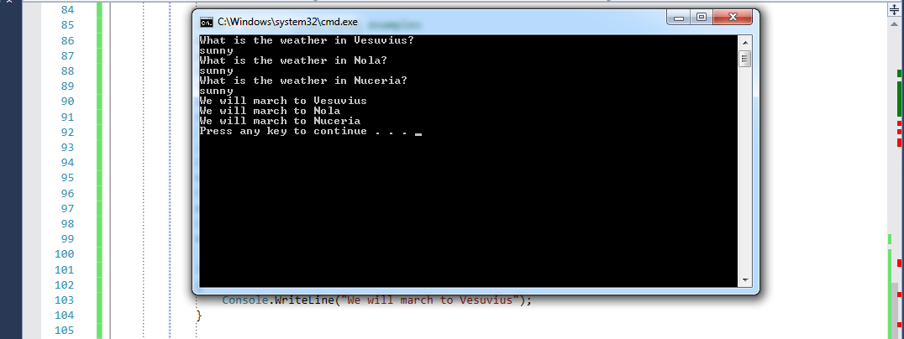

title: Conditionals
subtitle: If not that, then… ?
theme: league

## An Insightful Process


*This diagram isn't quite right. If you don't think learning to code is difficult, then you miiiight not get it yet.*

## Conditional Statements

<div float="right"></div>

- Conditional statements are one of the ways that we control the flow of a program.

- We control the flow by making decisions.

- Lets walk through the flow control diagram above.

## Hero's fight battles!!'

- Lets revisit or hero Spartacus in our Hello World program.

- If its not already, open your <mark>HelloWorld</mark> program in Visual Studio.

- Spartacus, like all heros, makes his living fighting battles.

- We will use conditional statements to help our hero do the following:

	- Choose which battle to fight

	- Choose the route to take

	- Choose how may soldiers to take into battle.
	
## We should all be here

<div float="right"></div>

- Volunteer time

- Lets start by <mark>Commenting out</mark> part ten.

<div class="fragment">
Question time: What are two of the methods we can use to comment code?
</div>

## Decision time

- We need to give our hero some choices of what cities his army can fight the Roman empire.

- Likewsie giving Spartacus options on which route he can take would be nice.

- Lets start with the cities. We will write a scenerio is normal language, then convert it to code.

- Spartacus has three cities from which to choose: Vesuvius, Nola, Nuceria.

- The weather plays a huge part in when and where to fight battles, so the weather will dictate his choice of city.

- If the weather is sunny Vesuvius, Spartacus will march his army to Vesuvius.

- If the weather is raining in Vesuvius and Nuceria but sunny in Nola, then Nola is in play.

- Finally, If it is raining in Vesuvius and Nola, but sunny in Nuceria, then Nuceria should expect a visit.
 
## Lets experiment

- When making decisions in coding one of the methods we commonly use is the <mark>if</mark> statements.

- We can see how this corresponds with our story.

	- <mark>If</mark> the weather is sunny in central Italy, then Spartacus will march his army to Vesuvius.

- In order to write our first <mark>if</mark> statement we must refresh our memory on the <mark>equality</mark> operators we learned in a previous lecture.

- I need two volunteers to come to the whiteboard and refresh our memories.

<div class="fragment">
Question time: Do we need to create any variables to use in our <mark>if</mark> statement? If so what should they be?
</div>

!SLIDE

- After reading our story, we see we <mark>will</mark> need to declare some variables and assign them some values.

- Spartacus has three cities from which to choose: Vesuvius, Nola, Nuceria.

- Lets create three variables one for each city. 

<div class="fragment">
Question time: What type of variable should we use?
</div>

<div class="fragment">
<p>Add the following code below part ten of your HelloWorld program:</p>
<pre><code class="language-C#">
//Part eleven conditional examples
string city1 = "Vesuvius";
string city2 = "Nola";
string city3 = "Nuceria";
</code></pre>
</div>

## We whould all be here

<div float="right"></div>

- In order to make the correct decision, Spartacus needs a weather report from each City.

- We will have our program ask for the weather in each city. 

- Lets create three variables which will be assigned a weather value from the user.

!SLIDE

<div class="fragment">
<p>Add the following code below part ten of your HelloWorld program:</p>
<pre><code class="language-C#">
//Part eleven conditional examples
string city1 = "Vesuvius";
string city2 = "Nola";
string city3 = "Nuceria";
string Vesuvius;
string Nola;
string Nuceria;
</code></pre>
</div>

<div class="fragment">
Question time: What built in method does C# provide to recieve input from a user at the console?
</div>

## Continue building

<p>Add the following code below part ten of your HelloWorld program:</p>
<pre><code class="language-C#">
//Part eleven conditional examples
string city1 = "Vesuvius";
string city2 = "Nola";
string city3 = "Nuceria";
string vesuvius;
string nola;
string nuceria;

//Solicit user input example
Console.WriteLine("What is the weather in {0}?", city1);
vesuvius = Console.ReadLine();
Console.WriteLine("What is the weather in " + city2 + "?");
nola = Console.ReadLine();
Console.WriteLine("What is the weather in Nuceria?");
nuceria = Console.ReadLine();
</code></pre>
 
## We should all be here

<div float="right"></div>

- Now that we have some code we can test, lets use three temporary <mark>Console.WriteLines()</mark> to test our output.

- I need two volunteers to write the correct code to test our output on the whiteboard.

## Test test test then test some more

<p>Add the following code below part ten of your HelloWorld program:</p>
<pre><code class="language-C#">
//Part eleven conditional examples
string city1 = "Vesuvius";
string city2 = "Nola";
string city3 = "Nuceria";
string vesuvius;
string nola;
string nuceria;

//Solicit user input example
Console.WriteLine("What is the weather in {0}?", city1);
vesuvius = Console.ReadLine();
Console.WriteLine("What is the weather in " + city2 + "?");
nola = Console.ReadLine();
Console.WriteLine("What is the weather in Nuceria?");
nuceria = Console.ReadLine();

Console.WriteLine("The weather in {0} is {1}", city1, vesuvius);
Console.WriteLine("The weather in " + city2 + " is " + nola);
Console.WriteLine("The weather in Nuceria is " + nuceria);
</code></pre>

## Execute our Test

- Place the following values when prompted:

	- input1 = <mark>sunny</mark>

	- input2 = <mark>raining</mark>

	- input3 = <mark>raining</mark>
<div class="fragment">
<p>We should all be here</p>
<div float="right"></div>
</div>

## So where will Spartacus go!!

- Now that our code is tested and works as we expected, lets start buliding our decision logic.

- Sart with the first statement: <mark>If</mark> the weather is sunny in Vesuvius, then Spartacus will march his army to Vesuvius.

<p>Make the following changes and additions to your code:</p>
<pre><code class="language-C#" data-noescape>
//Solicit user input example
Console.WriteLine("What is the weather in {0}?", city1);
vesuvius = Console.ReadLine();
Console.WriteLine("What is the weather in " + city2 + "?");
nola = Console.ReadLine();
Console.WriteLine("What is the weather in Nuceria?");
nuceria = Console.ReadLine();

<mark>if(vesuvius == "sunny"){
	Console.WriteLine("We will march to Vesuvius");
}</mark>
</code></pre>

<div class="fragment">
Question time: What value is returned if vesuvius == "sunny"? Remember to think bool. What do you expect to happen if the statement is true?
</div>

<div class="fragment">
Execute the program with the following values: sunny, sunny, sunny.
</div>

## We should all be here

<div float="right"></div>

- We know when the <mark>equality</mark> was executed its value was <mark>true</mark> so the code within the <mark>if</mark> statement was executed.

- Lets include the next two cites and test our code with the following values: sunny, sunny sunny.

!SLIDE

<p>Make the following changes and additions to your code:</p>
<pre><code class="language-C#" data-noescape>

if(vesuvius == "sunny"){
	Console.WriteLine("We will march to Vesuvius");
}
<mark>if(nole == "sunny"){
	Console.WriteLine("We will march to Vesuvius");
}</mark>
<mark>if(nuceria == "sunny"){
	Console.WriteLine("We will march to Vesuvius");
}</mark>
</code></pre>

## We should all be here

<div float="right"></div>

- Well his doesnt really help our hero, because according to our logic he is marching to all three cities.

- In order to set him up for success, we need to include something else in our code to narrow down our choices.

<div class="fragment">
Question time: What type of operator should we use to help us narrow down our choices?
</div>

## Its only logical Captian Kirk

- Because Spartacus has to make a decision based on the weather in three cities, we need to have three statments to test all three conditions.

- We will use the <mark>logic</mark> operators <mark>&&</mark> and <mark>||</mark> to help us reach our goal.

- Lets look back at our statments and see where our <mark>logical</mark> operators will come into play.

- If the weather is sunny Vesuvius, Spartacus will march his army to Vesuvius.

- This statement is telling Spartacus that if the sun is shining in Vesuvius, then he will march to Vesuvius. It doesnt matter what the weather is anywhere else.
<p>Would you agree this statement is fine? There is only one condition we need to meet.</p>
<pre><code class="language-C#" data-noescape>

if(vesuvius == "sunny"){
	Console.WriteLine("We will march to Vesuvius");
}
</code></pre>

!SLIDE

- Now lets look at the second statement: If the weather is raining in Vesuvius and Nuceria but sunny in Nola, then Nola is in play.

<p>We could read this statement as follows:</p>
<pre><code class="language-C#" data-noescape>

if(vesuvius == "raining") && (nuceria == "raining") && (nola == "sunny"){
	Console.WriteLine("We will march to Nola");
}
if(vesuvius == "raining") && (nuceria == "sunny") && (nola == "raining"){
	Console.WriteLine("We will march to Nuceria");
}
</code></pre>

- Is the two example we have used the <mark>&& or and</mark> operator to narrow down our options.

<div class="fragment">
Question time: What does the && operator tell each bool value of each equality operator must return?
</div> 

## Test test test and test again

- Make the follwing additions to your code.

<p>Make the follwing additions to your code.</p>
<pre><code class="language-C#" data-noescape>
if(vesuvius == "sunny"){
	Console.WriteLine("We will march to Vesuvius");
}
if((vesuvius == "raining") && (nuceria == "raining") && (nola == "sunny")){
	Console.WriteLine("We will march to Nola");
}
if((vesuvius == "raining") && (nuceria == "sunny") && (nola == "raining")){
	Console.WriteLine("We will march to Nuceria");
}
</code></pre>

- Execute the program with the following input: sunny, sunny, sunny.

## We should all be here

<div float="right"></div>

<div class="fragment">
Question time: Why did we get the answer we receieved?
</div>


<div class="fragment">
Answer time: Because of the && operator, all of the equalities must evalute to true or the code inside the if statement will not be executed.
</div>

<div class="fragment">
Answer time: Although the two other cities were sunny which returned true, the two remaing equalities returned false.
</div>

!SLIDE


*If* I am 16 or older, *then* I can drive legally.

<div class="fragment">
<p>In C#, we would say:</p>
<pre><code class="language-C#">int age = 42;
if (age >= 16) {
  Console.WriteLine("You are " + age + ", so you are legal to drive.");
}</code></pre>
</div>

<div class="fragment">
Question time: What do think would happen if age == 15?
</div>
## We might say…

*If* I get eight or more hours of sleep, I am likely to feel more rested.

<div class="fragment">
<p>In C#, we would say:</p>
<pre><code class="language-C#">int hoursOfSleep = 42;
if (hoursOfSleep >= 8) {
  Console.WriteLine("You are likely to feel more rested.");
}</code></pre>
</div>

<div class="fragment">
Question time: What would happen if we changed the condition statement to read (hoursOfSleep !> 8)?
</div>

<div class="fragment">
<p>We can follow one conditional with another.</p>
<pre><code class="language-C#">if (hoursOfSleep == 42) {
  Console.WriteLine("He used 42 again, didn't he?");
 }
 if(hoursOfSleep == 52){
   Console.WriteLine(hoursOfSleep + "Aint such a bad number");
 }
 </code></pre>
</div>
<div class="fragment">
Question time: What do you think would happen if hoursOfSleep == 42?
</div>
<div class="fragment">
Question time: What do you think would happen if hoursOfSleep == 52?
</div>
<div class="fragment">
Question time: What do you think would happen if hoursOfSleep == 102?
</div>

## So let break down the 'if' statement!!

An `if` statement starts with the keyword `if`:
<pre><code class="language-C#" data-noescape>int heightInInches = 73;

<mark>if</mark>(heightInInches >= 60) {
  Console.WriteLine("You are tall enough to ride");
}</code></pre>

## Next comes the decision

'if' is then followed by parentheses that contain a *condition*:
<pre><code class="language-C#" data-noescape>int heightInInches = 73;

if<mark>(</mark>heightInInches >= 60<mark>)</mark> {
  Console.WriteLine("You are tall enough to ride");
}</code></pre>

## Lets think through an example

```C#
int heightInInches = 73;

if(heightInInches >= 60) {
  Console.WriteLine("You are tall enough to ride");
}
```
<div class="fragment">
Question time: If we sent the result of the conditional statement (heightInInches >= 60) to the console, what do you think we would see?
</div>


## Lets code it and see what results returned if any!

```C#
int heightInInches = 73;

    if (heightInInches >= 60)
    {
        Console.WriteLine("You are tall enough to ride");
    }
		Console.WriteLine("You are to short to ride);
		Console.WriteLine(heightInInches >= 60);
```

<div class="fragment">
Question time: What results did you get and were the results what you expected?
</div>
<div class="fragment">
Question time: What data type do you think is represented with the answer you received?
</div>

## Lets try again

Change the value of heightInInches to 42
 
<pre><code class="language-C#">int heightInInches = 42;

if(heightInInches >= 60) {
  Console.WriteLine("You are tall enough to ride");
}
	Console.WriteLine("You are to short to ride);
    Console.WriteLine(heightInInches >= 60);

</code></pre>

<div class="fragment">
Question time: What results did you get and were the results what you expected?
</div>
<div class="fragment">
Question time: Again, what data type do you think is represented with the answer you received?
</div>

## We want the truth!!... Or Not!!

As we have seen the *condition* evaluates to a `boolean` value:
<pre><code class="language-C#" data-noescape>int heightInInches = 73;

if(<mark>heightInInches >= 60</mark>) {
  Console.WriteLine("You are tall enough to ride");
}</code></pre>

## Ok where does all the work take place?

This is followed by a code block that executes only if the *condition* is `true`. Remember that code blocks open with a left curly bracket (`{`) and close with a right curly bracket (`}`):
<pre><code class="language-C#" data-noescape>int heightInInches = 73;

if(heightInInches >= 60) <mark>{</mark>
  Console.WriteLine("You are tall enough to ride");
<mark>}</mark></code></pre>

<pre><code class="language-C#" data-noescape>int heightInInches = 73;

if(heightInInches >= 60) 
  Console.WriteLine("You are tall enough to ride");</code></pre>

## Else what?

It's polite to offer an apology, eh? We can be polite.

An `if` statement allows us to do something else if its *condition* does not evaluate to `true`:

<pre><code class="language-C#" data-noescape>int heightInInches = 42;

if(heightInInches >= 60) {
  Console.WriteLine("You are tall enough to ride.");
} else {
  Console.WriteLine("I'm sorry, too short.");
}</code></pre>

## And then?

We can create sequences of `if/else` statements:

```C#
if(heightInInches >= 60) {
  Console.WriteLine("You are tall enough to ride.");
} else if(heightInInches >= 30) {
  Console.WriteLine("Try the teacups. They look fun.")
} else {
  Console.WriteLine("I'm sorry, too short.");
}
```

Think of this as connecting multiple `if/else` statements.

# Swichin' it up!

Sometimes, we can use a `switch/case` statement to replace several `if/else` statements. Let's say we are categorizing our amusement park patrons into the following groups based on their ageGroup:adult, youngster, and everyone else.

## The teacups are fun, right?

We can use a `switch/case` statement to execute one or more statements based on a value:

```C#
String ageGroup = "youngster";

switch (ageGroup) {
case "adult":
	Console.WriteLine("You can ride the rollercoaster!");
	break;
case "youngster":
	Console.WriteLine("The teacups are fun.");
	break;
default:
	Console.WriteLine("Oh, you must be a toddler. Toddle on!");
}
```
<div class="fragment">
What is displayed if we change `ageGroup`'s value to "adult"? Why?
</div>
<div class="fragment">
What is displayed if we change its value to anything other than "adult" or "youngster"? Why?
</div>
<div class="fragment">
What functions does the 'break' statement perform?
</div>

## Lets switch it up a little

 You are getting ready to take a trip to Columbus for work. You were thinking about all the items you should pack. 

 You need to base the items you will take on the current tempurature in Columbus Oh.

 Write a 'swtich' statement that will use the currentTemp in Columbus, Oh to decide which of the following you should bring: Parka, Down Feather Jacket, PCoat, sweater.