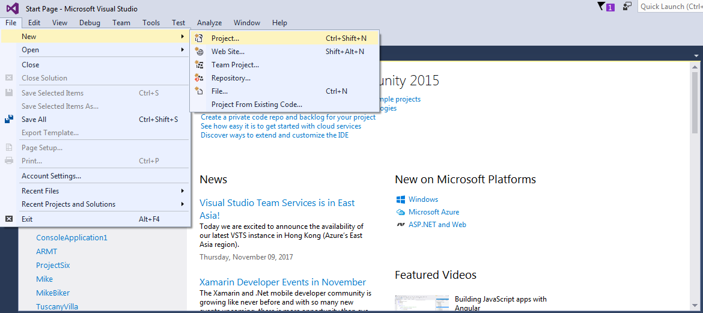
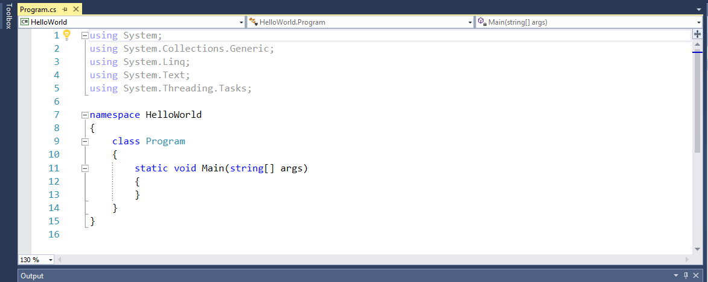

title: Hello World
subtitle: Your First C# Program
theme: league

% TODO update screenshots for Windows UI

# Project Setup

## Let's Launch Visual Studio

<div float="right"></div>

Visual Studio is our **I**ntegrated **D**evelopment **E**nvironment (**IDE**). IDEs integrate common development tasks with our editor.

Accept the default for workspace. (More on that later.)

## Create a C# Project

% TODO <em> below should probably be a caption class

<div class="sidebar">
	
</div>

% fake list, since lists don't 'float' properly

• From the *File* Menu, select *New > Project*.

## Create a C# Project Continued

<div class="sidebar">
	
</div>

• Select *Conole Application* from the *New Project* Window.

• Specify a *Project name* of *Hello-World* as in the screenshot.

• Click the *Ok* button.

## Now You've Got a NameSpace with a Class!
<div class="sidebar">
	
</div>

• You should see code similar to the following in your editor:

# Let's Break It Down

## C# namespace and Classes

All C# code is found inside a *class* which is defined in a *namespace*. This namespace is called `HelloWorld`, and the class is called Program.


<pre><code class="language-C#" data-noescape>namespace <mark>HelloWorld</mark>  
{
	<mark>class Program</mark>
	{
		public static void main(String[] args) 
		{
		}

	}
}
</code></pre>

## C# Methods

Think of *Methods* as the messages that we send in C#. All C# applications start with a `main` method. We will discuss C# methods in more detail later in the course.


<pre><code class="language-C#" namespace HelloWorld 
{
	class Program
	{
		<mark>public static void main(String[] args)<mark/> 
		{
		}

	}
}
</code></pre>

## Curly Brackets

Curly brackets (`{` and `}`) indicate code blocks in C#. As you start down your coding journey, you will find them essential to your trouble shooting efforts. An opening curly bracket (`{`) must **always, always, always** have a corresponding closing curly bracket (`}`). Did we say "ALWAYS"?

### This applies to classes…

% 'data-noescape' attribute tells it to ignore our <mark> tags

<pre><code class="language-C#" namespace HelloWorld 
<mark>{<mark/> *This opening curly braces signifies the opening of the namespace*

	class Program
	{
		public static void main(String[] args) 
		{
		}

	}
}


!SLIDE

### … as well as methods.

<pre><code class="language-java" data-noescape>public class HelloWorld {

	public static void main(String[] args) <mark>{</mark>
		// TODO Auto-generated method stub

	<mark>}</mark>

}


## Comments

We can add comments to our code to explain it. They don't *do* anything.

Here, Eclipse has created a `TODO` comment for us to remind us that we need to do something—namely, write some code inside the method! We'll do that next.

<pre><code class="language-java" data-noescape>public class HelloWorld {

	public static void main(String[] args) {
		<mark>// TODO Auto-generated method stub</mark>

	}

}
</code></pre>

# Hello World!

A common first program for people to write in a language is a program that says "Hello, World!" That's just what we'll do. Change your code to look like the following:

<pre><code class="language-java" data-noescape>public class HelloWorld {

	public static void main(String[] args) {
		System.out.println("Hello, World!");
	}

}
</code></pre>

`println` is short for "print line". `System.out` represents our console/terminal/command line. Here we are sending a `println` message to `System.out` with the content `"Hello, World!"`

Let's run it, and see what happens!

## A Simple Greeting

Right click inside your editor (the pane where you've been modifying the code), then select *Run As > Java Application*. Your program will run, and your *Console* *view* should display something like the following:

```bash
Hello, World!
```
Climactic, eh?

You've written your first Java program. Congratulations!

## Next Steps

Java is a *strongly-typed* language. The type of `"Hello, World!"` is `String`, which is denoted by the double quotation marks:

<pre><code class="language-java" data-noescape>System.out.println(<mark>"</mark>Hello, World!<mark>"</mark>);</code></pre>

We can also do this with other Strings:

<pre><code class="language-java" data-noescape>System.out.println(<mark>"</mark>I can code it!<mark>"</mark>);</code></pre>

## Other Data Types

We can also display numbers and more complex expressions.

<pre><code class="language-java" data-noescape>System.out.println(42);
System.out.println(1.23);
System.out.println(2 + 3);</code></pre>

Try a few of your own! We'll talk about other data types and expressions in days to come.


% TODO should move this after I've nailed it down

<style type="text/css">
.reveal section img.logo {
	border: none;
	background-color: rgba(255, 255, 255, 0.25);
	padding: 1rem;
}
.reveal ol, .reveal dl, .reveal ul {
	margin: 0 0 1rem 2rem;
}
</style>
