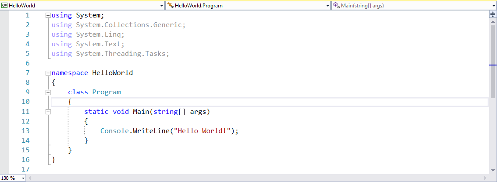
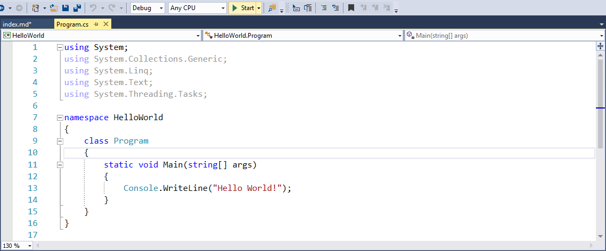
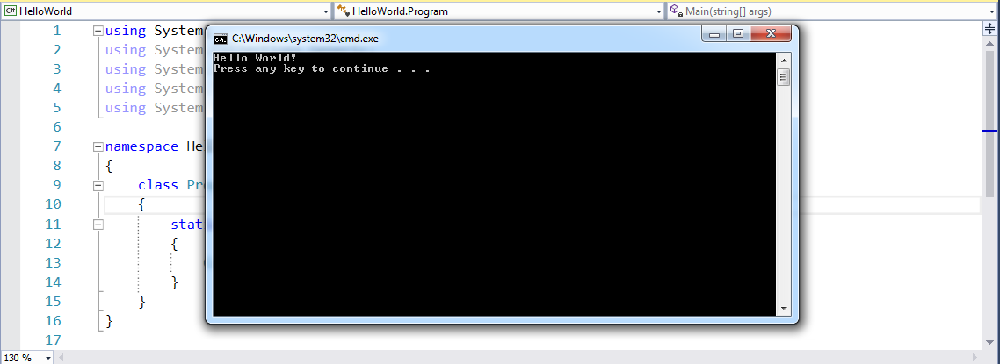

title: Hello World
subtitle: Your First C# Program
theme: league

% TODO update screenshots for Windows UI

# Project Setup

## Let's Launch Visual Studio

Visual Studio is our **I**ntegrated **D**evelopment **E**nvironment (**IDE**). IDEs integrate common development tasks with our editor.

Accept the default for workspace. (More on that later.)

© We Can Code IT, LLC

## Create a C# Project

% TODO <em> below should probably be a caption class

	

% fake list, since lists don't 'float' properly

• From the *File* Menu, select *New > Project*.

## Create a C# Project Continued

	

• Select *Conole Application* from the *New Project* Window.

• Specify a *Project name* of *Hello-World* as in the screenshot.

• Click the *Ok* button.

## Now You've Got a NameSpace with a Class!

	

• You should see code similar to the following in your editor:

# Let's Break It Down

## C# namespace and Classes

All C# code is found inside a *class* which is defined in a *namespace*. This namespace is called `HelloWorld`, and the class is called Program.

<pre><code class="language-C#" data-noescape>namespace <mark>HelloWorld</mark>  
{
	<mark>class Program</mark>
	{
		public static void main(String[] args) 
		{
		}

	}
}
</code></pre>

## C# Methods

Think of *Methods* as the messages that we send in C#. All C# applications start with a `main` method. We will discuss C# methods in more detail later in the course.

<pre><code class="language-C#" data-noescape>namespace HelloWorld 
{
	class Program
	{
		<mark>public static void main(String[] args)</mark> 
		{
		}

	}
}
</code></pre>

## Curly Brackets

Curly brackets (`{` and `}`) indicate code blocks in C#. As you start down your coding journey, you will find them essential to your trouble shooting efforts. An opening curly bracket (`{`) must **always, always, always** have a corresponding closing curly bracket (`}`). Did we say "ALWAYS"?

## This applies to a namespace.

% 'data-noescape' attribute tells it to ignore our <mark> tags

<pre><code class="language-C#" data-noescape>namespace HelloWorld 
<mark>{</mark> This opening curly brace signifies the opening of the namespace

	class Program
	{
		public static void main(String[] args) 
		{
		}

	}
<mark>}</mark> This closing clurly brace signifie the closing of the namespace

</code></pre>

## … as well as Classes.

<pre><code class="language-C#" data-noescape>namespace HelloWorld 
{

	class Program
	<mark>{</mark> This opening curly brace signifies the opening of the class Program

		public static void main(String[] args) 
		{
		}

	<mark>}</mark> This closing clurly brace signifie the closing of the class Program
}

</code></pre>

## … and finally Methods.

<pre><code class="language-C#" data-noescape>namespace HelloWorld 
{

	class Program
	{
		public static void main(String[] args) 
	<mark>{</mark> This opening curly brace signifies the opening of the main method

	<mark>}</mark> This closing clurly brace signifie the closing of the main method

	}
}

</code></pre>
## Comments

We can add comments to our code to explain it. Comments are very important as they not only help us remember what function our code is performing, comments can also help team members, code testers, and future developers to understand, test and make changes to your application. They don't *do* anything.

Here, I have created a comment to remind me that I need to do something—namely, write some code inside the method! We'll do that next.

<pre><code class="language-java" data-noescape>public class HelloWorld {

	public static void main(String[] args) {
		<mark>// add code for future development</mark>

	}

}
</code></pre>

## ...Types of Comments

As you can see we used to '//' to denote a command. We can use '//' to comment out single lines. We can also use '/*' to start commenting multiple lines of code, and end with '*/'.
Finally we can also highlight the code we want to comment and use the following keystrokes to comment that code: Ctrl K C and the following keystrokes to uncomment code: Ctrl K U.
<pre><code class="language-C#" data-noescape>public class HelloWorld {

	public static void main(String[] args) {
		<mark>//</mark> add code for future development
		<mark>/*</mark>
		add code for futuer development
		<mark>*/</mark>
	}

}
</code></pre>

# Hello World!

A common first program for people to write in a language is a program that says "Hello, World!" That's just what we'll do. Change your code to look like the following:

<pre><code class="language-C#" data-noescape>class Program {

	public static void main(String[] args) {
		
		<mark>Console.WriteLine("Hello World!");</mark>

	}

}
</code></pre>

## Thumbs Up

`Console.WriteLine()` is a C# method that instructs our program to send the contents contained in the *()* to the console contained in our Visual Studio IDE. In our case the two words 'Hello World!' will appear in your console.

	

Here is what your program should look like.

Let's run it, and see what happens!

## A Simple Greeting

	

Press the *Start* button highlighted located in the top of the Visual Studio IDE.
Now press Ctrl F5 and the output will appear.

## Climactic, eh?

	

You've written your first C# program. Congratulations!

## Next Steps

C# is a *strongly-typed* language. The type of `"Hello, World!"` is `String`, which is denoted by the double quotation marks:

<pre><code class="language-C#" data-noescape>Console.WriteLine(<mark>"</mark>Hello, World!<mark>"</mark>);</code></pre>

We can also do this with other Strings:

<pre><code class="language-C#" data-noescape>Console.WriteLine(<mark>"</mark>I can code it!<mark>"</mark>);</code></pre>

## Other Data Types

We can also display numbers and more complex expressions.

<pre><code class="language-C#" data-noescape>Console.WriteLine(42);
Console.WriteLine(1.23);
Console.WriteLine(2 + 3);</code></pre>

Try a few of your own! We'll talk about other data types and expressions in days to come.

% TODO should move this after I've nailed it down

