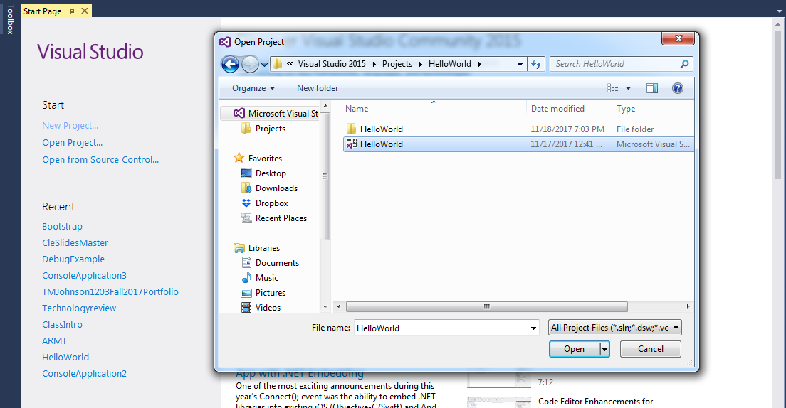
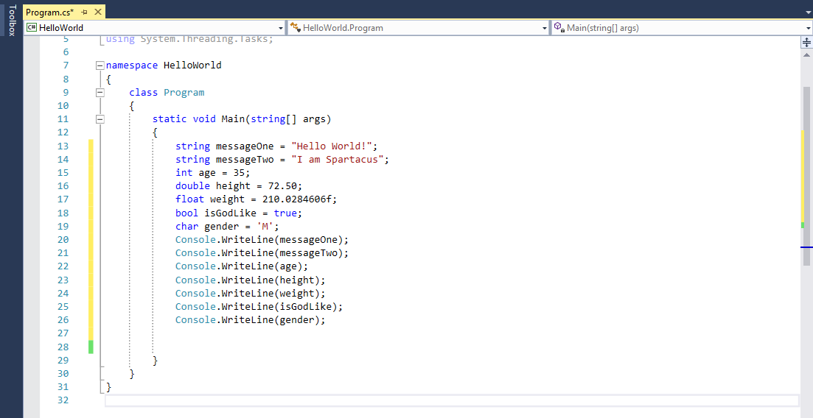

title: Operators and Expressions
subtitle: •••
theme: league


## Lets Build on what we learned yesterday

<div float="right"></div>

- We have already starting building our first application, so lets open <mark>Hello World</mark> and build upon our success

- Volunteer Time!!

- Open Visual Studio

- Select File > Open > Project Solution

!SLIDE

<div float="right"></div>

- Select HelloWorld > Open

## We should all be here!!

<div float="right"></div>

- Lets review a few things before we begin

<div class="fragment">
Question time: What is the differance between an integer and a float value type variables?
</div>

<div class="fragment">
Question time: When value type variable would you use to denote true or false?
</div>

<div class="fragment">
Question time: How would you denote the differance between a string and a char?
</div>

# Put on your math hats

- Throughout our academic careers, one of the main focus's of our education was arithmetic.

- We learned some basic fundamentals about how we perform basic operations like: addition, substraction, division, and mutliplication.

- We also learned each operation has its own <mark>operator</mark> which we use to show what type of operation we are performing.

- For example, if we wante to add we used the <mark>+</mark> operator. Subtract we used the <mark>-</mark> operator. Multiply we used the <mark>*</mark> symbol and when we divide <mark>/</mark>.

- In the first part of our lesson, we are going to dicuss how we use these same operators in coding, and how we use variables in place of the actual numbers we are accustomed to using.

- Likewise, we will introduce you to some operators you may not be familier with, but are critical in achieving clean sucessful code.

## Remember value type variables hold a value

- Lets look at our code we have already written. We highlighted each of the value type variables we declared. Likewise, we assigned a value to each.

<pre><code class="language-C#" data-noescape>
        static void Main(string[] args)
        {
            string messageOne = "Hello World!";
            string messageTwo = "I am Spartacus";
            <mark>int age</mark> = 35;
            <mark>double height</mark> = 72.50;
            <mark>float weight</mark> = 210.0284606f;
            <mark>bool isGodLike</mark> = true;
            <mark>char gender</mark> = 'M';
        }
    }
</code></pre> 

 <div class="fragment">
Question time: What is the value of height?
</div>

<div class="fragment">
Question time: What is the value of weight?
</div>

## Variable means the value can change

- When we are writing code, we use variables becuase often time the values we assign will change. Hence the term variable!!

- Because we know these values will change, we cannot directly address the actual values of the variables when performing math operations.

- In order to better visualize this concept, we will need to make some changes and additions to our code.

- Volunteer Time!!

!SLIDE

- Please make the highlighted additions and changes in your code.

 <pre><code class="language-C#" data-noescape>
        static void Main(string[] args)
        {
            string messageOne = "Hello World!";
            string messageTwo = "I am Spartacus";
            <mark>int ageOne  = 35;
            int ageTwo  = 45;
            double heightOne  = 72.50;
            double heightTwo  = 91.45;
            float weightOne  = 210.0284606f;
            float weightTwo  = 331.12345678f;
            bool isGodLikeOne  = true;
            bool isGodLikeTwo  = false;
            char genderMale  = 'M';
            char genderFemale  = 'F';
            Console.WriteLine(messageOne);
            Console.WriteLine(messageTwo);
            Console.WriteLine(ageOne + ageTwo);
            Console.WriteLine(heightOne - heightTwo);
            Console.WriteLine(weightOne * weightTwo);
            Console.WriteLine(isGodLikeOne);
            Console.WriteLine(genderMale);</mark>
        }
    }
</code></pre> 

## We should all be here

<div float="right"></div>

- Ok lets run our application and see our results

!SLIDE

<div float="right"></div>

<div class="fragment">
Question time: When we perform the addition operation on variables ageOne and ageTwo, what values are we adding? 
</div>

<div class="fragment">
Question time: When we perform the multiplcation operation on variables weightOne and weightTwo, what values are we multiplying? 
</div>

<div class="fragment">
Question time: Looking at our results, what logic can we infer about performing mathamatical operations using value type variables. 
</div>

<div class="fragment">
Question time: Is it safe to assume we are actually performing the operations on the contents of our value type variables? 
</div>

<div class="fragment">
Question time: Because we are using variables, if we assigned new values to our variables would our answers change? Lets do an experiment!! 
</div>

## Lets test your knowledge

- Volunteer time!!

- Working in pairs, I want you to assign these values to the following variables:

	- Assign ageTwo a new value of 110.

	- Assign heightTwo a new value of 35.12345f.

	- Assign weightTwo a new value of -429.1234573f.

- Do not change the original values, as we want to see the orginal output and the new output so we can compare the differance.

- We want our new calculations to be sent to the console, so write a statement to display our new calculations to the console.

- Once you have assigned the variables new values and written the code to send them to the console, go ahead and save your project then run it!!

## Lets see our results

<div float="right"></div>

- Did anyone get get differant results?

- Lets look at our code.

## We should all be here

<div float="right"></div>

- You will find in coding as you have found in life. There are many roads and techniques you can utilize which will give you the same result.

- Even if you achived the same results, but your code does not look the same as the code above, then please take a minute to change your code.

- For the sake of continuity, we need all your code to look the same as mine.

## So what have we learned

<div class="fragment">
We learned if we assigned new values to our variables our answers will change.
</div>

<div class="fragment">
Question time: What is the advantage of using variables when performing mathamatical operations when coding? 
</div>

<div class="fragment">
-Here is a referance chart you can use to refresh your memory on what we have learned so far.
</div>


int a = 25 int b = 15

|Operator|Operation|Description|Expression|Result
|--------|---------|-----------|------------------|------
|+|addition|adds two operands|`a + b`|25
|-|subtraction|subtracts second operand from the first|`a - b`|-5
|*|multiplication|multiplies the operands|`a * b`|150

## What happened to division?

- Now its time to introduce you too the two operators that deal with division

- The first is one you are already aware of the division <mark>/</mark> operator.

- A new operator you might not be aware of is the Modulus <mark>%</mark> operator.

- In order to better visualize this concept we will be discussing, we will need to make some changes and additions to our code.

- Volunteer Time!!


!SLIDE

- Please make the highlighted additions and changes in your code on the next slide.

- Be aware some code has been hidden from this view in order to read the changes.

 <pre><code class="language-C#" data-noescape>
	static void Main(string[] args)
        {
            string messageOne = "Hello World!";
            string messageTwo = "I am Spartacus";
            int ageOne  = 35;
            int ageTwo  = 45;
            <mark>int ageThree = 80;</mark>

            <mark>The code inbetween has been hidden for readability</mark>

			ageTwo = <mark>70</mark>;
            heightTwo = 35.12345f;
            weightTwo = -429.1234573f;
            Console.WriteLine(ageOne + ageTwo);
            Console.WriteLine(heightOne - heightTwo);
            Console.WriteLine(weightOne * weightTwo);
            <mark>Console.WriteLine(ageTwo / ageOne);
            Console.WriteLine(ageTwo % ageOne);
            Console.WriteLine(ageThree / ageOne);
            Console.WriteLine(ageThree % ageOne);</mark>
		}
   </code></pre> 

## We should all be here

<div float="right"></div>

- Lets run our program and discuss the results


## So lets discuss our results.

<div float="right"></div>

- <mark>ageTwo / ageOne</mark> gave us the expected result of <mark>2</mark> because 70 / 35 = 2; No suprise there.

- <mark>ageTwo % ageOne</mark> gave us <mark>0</mark> as a result. <mark>0</mark>?

- Ok so <mark>ageThree / ageOne</mark> gave us the expected result of <mark>2</mark>, but is 2 really the correct answer?

- Finally what is up with <mark>ageThree % ageOne</mark> giving us a result of <mark>10</mark>?

- Do we have any math genius's in the classroom? Can anyone quess why we are getting the results we are getting?

## Its all about whats left over

- The modulus operator will give us the <mark>remainder</mark> in a division caluclation.

- When you look at both operators <mark>/</mark> and <mark>%</mark> they are each responsible for returning one of the two values we would expect perfoming normal division.

- Lets look at some easy examples for mod.

 <div class="fragment">
<div float="right"></div>
</div>

<div class="fragment">
The modulus operator will have my useful benefits in coding, so make sure you understand the modulus concept.
</div>

-Here is a referance chart you can use to refresh your memory on what we have learned so far.

int a = 25 int b = 15

|Operator|Operation|Description|Expression|Result
|--------|---------|-----------|------------------|------
|/|division|divides first operand by second operand|`b / a`|1
|%|modulus (remainder)|returns the remainder after integer division|`b % a`|5


## Increment and decrement operators

- In the field of coding, there often comes the need to add or subtract by <mark>1</mark>.

- You will see this predominantly in loops and counters. We will go into great detail about loops and counters later in the course.

- We may need to count everytime a loop is run, or we may need to count the number of times a value has changed.

- One way of adding <mark>1</mark> to an variable is to simply write: <mark>ageTwo = ageTwo +1;</mark>

	- The caluclation on the right side of our statement ageTwo = <mark>ageTwo + 1</mark>; is performed first.

	- Because <mark>ageTwo</mark> is a value type variable, we can save our calculation in <mark>ageTwo</mark>.

	- Lets do an experiment!!

- In order to better visualize this concept we will be discussing, we will need to make some changes and additions to our code.

- Volunteer Time!!

!SLIDE

- Please make the highlighted additions and changes in your code on the next slide.

- Be aware some code has been hidden from this view in order to read the changes.

 <pre><code class="language-C#" data-noescape>
	static void Main(string[] args)
        {
            <mark>The code inbetween has been hidden for readability</mark>

			ageTwo = 70;
            heightTwo = 35.12345f;
            weightTwo = -429.1234573f;
            Console.WriteLine(ageOne + ageTwo);
            Console.WriteLine(heightOne - heightTwo);
            Console.WriteLine(weightOne * weightTwo);
            <mark>Console.WriteLine(ageTwo / ageOne);
            Console.WriteLine(ageTwo % ageOne);
            Console.WriteLine(ageThree / ageOne);
            Console.WriteLine(ageThree % ageOne);</mark>
			ageTwo = ageTwo + 1;
            Console.WriteLine(ageTwo);
		}
   </code></pre> 

## We should all be here

<div float="right"></div>

- Lets run our program and discuss the results


## So lets discuss our results.

<div float="right"></div>

- An examination of our code shows ageTwo was assigned a value of <mark>70</mark>.

- When we assigned the new value by adding <mark>1</mark> to ageTwo thus increasing the value by <mark>1</mark>.

- This step is called <mark>incrementing</mark>. If we were to subtract by <mark>1</mark> this step would be called <mark>decrementing</mark>.

- Convienently though C# has gven us a shortcut to perform the same function.

- We can use the operater <mark>++</mark> to increment by <mark>1</mark> or the operator <mark>--</mark> to decrement by <mark>1</mark>.

- Lets make some changes to our code and see how it works.

!SLIDE

- Add the following code under the last line on code in our project:

```C#
ageTwo++;
Console.WriteLine(ageTwo);
ageTwo--;
Console.WriteLine(ageTwo);
```
## We should all be here

<div float="right"></div>

- Lets run our program and discuss the results

## So lets discuss our results.

<div float="right"></div>
 
 - As we have seen, the <mark>increment and decrement</mark> allow us to perform the same functions as the variable assignment, but the amount of code is significanlty decreased.

 - We also have flexibility with the <mark>increment and decrement</mark> oerators to add or subtract values greater than <mark>1</mark>.

!SLIDE

 - Likewise, we can perform post <mark>increment and decrement</mark> operations.

 - Observe the following code for examples

 ```C#
//Post increment and decrement by 1 example
ageTwo++;
ageTwo--;
//Post increment and decrement by 2 example
ageTwo+=2;
ageTwo-=2;
//Pre increment and decrement by 1 example
++ageTwo;
--ageTwo;
```
- Although we do not commonly use the last two increment and decrement examples, they can and will be useful. 

- I would suggest experimenting with both during your coding practice.

## Equality operators

- We have seen how we use the <mark>=</mark> operator to assign a value to a variable.

- I think of the <mark>=</mark> operator in the terms of ownership. Lets review the following line of code.

	- ageTwo = 70;

	- By using the <mark>=</mark> operator, we can say that ageTwo owns the value <mark>70</mark>.

- We also have another catagory of operators which use the <mark>=</mark> operator. We use the following <mark>equality</mark> operators when we need to make decisions on the flow of logic.

- It is important to note using and <mark>equality</mark> operator will not return a numeric value. The <mark>equality</mark> operator will instead return a value of <mark>True</mark> or <mark>False</mark>.

- We will see plenty of examples in upcoming classes which will demonstrate how to use <mark>equality</mark> operators. For our purposes I will highlight a few examples.

	- The <mark>==</mark> operator tests for equality. An example would be (5 == 5).  We know 5 <mark>is equal to</mark> 5, so the value returned will be <mark>True</mark>.

	- Another example would be (5 == 56).  We know 5 <mark>is not equal to</mark> 56, so the value returned will be <mark>False</mark>.

	- Yet another example would be ('5' == 5).  Can someone guess what the return value will be. Why?

## Inequality

- We can also check for <mark>inequality</mark> with the <mark>inequality</mark> operator <mark>!=</mark>.

- We will see plenty of examples in upcoming classes which will demonstrate how to use <mark>inequality</mark> operators. For our purposes I will highlight a few examples.

	- In programming, we commonly use the <mark>!</mark> as a <mark>not</mark> operator.
	
	- The <mark>!=</mark> operator tests for inequality. An example would be (5 != 5).  We know 5 <mark>is equal to</mark> 5, so the value returned will be <mark>False</mark>.

	- Another example would be (5 != 56).  We know 5 <mark>is not equal to</mark> 56, so the value returned will be <mark>True</mark>.

	- Yet another example would be ('5' != "five").  Can someone guess what the return value will be. Why?


## Relational operators

- If we think back again to our early education years, we will remember using the following operators.

	- We would use the <mark>< ></mark> operator to check if value <mark>a</mark> is less than or greater than value <mark>b</mark>. 
	
	- So <mark>a < b</mark> checks to see if <mark>a</mark> is less than value <mark>b</mark>.

	- Likewise, <mark>a > b</mark> checks to see if <mark>a</mark> is greater than value <mark>b</mark>.
	
- Now lets incorporate our <mark>=</mark> operator.

	- So <mark>a <= b</mark> checks to see if <mark>a</mark> is less than or equal to value <mark>b</mark>.

	- Likewise, <mark>a >= b</mark> checks to see if <mark>a</mark> is greater than or equal to value <mark>b</mark>.
	
<div class="fragment">
Question time: What value is returned with the following: ("pete" !> "PETE")? Why? 
</div>

<div class="fragment">
Question time: What value is returned with the following: (5 <= 2)? Why? 
</div>
	
!SLIDE

If variable *a* holds 10 and variable *b* holds 15, then:

|Operator|Operation|Description|Expression|Result
|--------|---------|-----------|------------------|------
|>|greater than|evaluates to true of the first operand is greater than the second operand|`a > b`|false
|>=|greater than or equal to|evaluates to true of the first operand is greater than *or equal to* the second operand|`a >= b`<br>`a >= 10`|false<br>true
|<|less than|evaluates to true of the first operand is less than the second operand|`a < b`|true
|<=|less than or equal to|evaluates to true of the first operand is less than *or equal to* the second operand|`a <= b`<br>`a <= 10`|true<br>true

## Write practice statements for the logical operators

If variable *a* holds `true` and variable b holds `false`, then:

|Operator|Operation|Description|Expression|Result
|--------|---------|-----------|------------------|------
|&&|conditional AND|evaluates to true if both operands are true;<br>otherwise, evaluates to false|`a && b`<br>`a && true`|false<br>true
|&#124;&#124;|conditional OR|evaluates to true if either operand is true;<br>otherwise, evaluates to false|`a || b`<br>`b || false`|true<br>false

% TODO TMI? Note that the conditional AND and OR are *short-circuit* operators.

## Translating English to CSharp

Let's translate English statements into C#. First, we'll do one together.

Start by writing the statements as comments. Here's an example:

```C#
// Jessica is 23 years old.
int jessicaAge = 23;

// Sam is 47.
int samAge = 47;

// Jessica is younger than Sam.
Console.WriteLine(jessicaAge < samAge);
```

## Let's break it down…

### Defining a variable to hold Jessica's age:

We need to create a variable to hold the age of Jessica. What should its type be?

<p><code class="language-C# hljs"><span class="hljs-comment">// <span class="highlight">Jessica</span> is 23 <span class="highlight">years old</span>.</span></code></p>

<div class="fragment">
<p>Since we think of ages as whole numbers, we will use an <code>int</code>:</p>
<code class="language-C# hljs"><span class="highlight"><span class="hljs-keyword ">int</span> jessicaAge</span></code>
</div>

## Let's break it down…

### Assigning a value for Jessica's age:

The word "is" means equals. How do we represent assignment?

<p><code class="language-C# hljs"><span class="hljs-comment">// Jessica <span class="highlight">is 23</span> years old.</span></code></p>

<div class="fragment">
<p>If Jessica "is 23", then Jessica's age = 23:</p>
<code class="language-C# hljs"><span class="hljs-keyword ">int</span> jessicaAge <span class="highlight">= <span class="hljs-number">23</span></span>;</code>
</div>

## Let's break it down…

### Comparing Jessica's and Sam's ages:

To say Jessica *is younger than* Sam means we are comparing their ages. Which operator would we use to compare them?

<code class="language-C# hljs"><span class="hljs-comment">// Jessica <span class="highlight">is younger than</span> Sam.</span></code>

<div class="fragment">
<p>We use the "less than" relational operator to perform this comparison:</p>
<code class="language-C# hljs">Console.WriteLine(jessicaAge <span class="highlight">&lt;</span> samAge);</code>
</div>

## Let's look at the syntax

Single line comments start with `//`:

<code class="language-C# hljs"><span class="hljs-comment"><span class="highlight">//</span> Jessica is 23 years old.</span><br>
<span class="hljs-keyword">int</span> jessicaAge = <span class="hljs-number">23</span>;<br>
<span class="hljs-comment"><span class="highlight">//</span> Sam is 47.</span><br>
<span class="hljs-keyword">int</span> samAge = <span class="hljs-number">47</span>;<br>
<span class="hljs-comment"><span class="highlight">//</span> Jessica is younger than Sam.</span><br>
Console.WriteLine(jessicaAge &lt; samAge);
</code>

## Let's look at the syntax

Each statement ends with a semicolon. It acts like a period (.) in English at the end of a sentence.

<code class="language-C# hljs"><span class="hljs-comment">// Jessica is 23 years old.</span><br>
<span class="hljs-keyword">int</span> jessicaAge = <span class="hljs-number">23</span><span class="highlight">;</span><br>
<span class="hljs-comment">// Sam is 47.</span><br>
<span class="hljs-keyword">int</span> samAge = <span class="hljs-number">47</span><span class="highlight">;</span><br>
<span class="hljs-comment">// Jessica is younger than Sam.</span><br>
Console.WriteLine(jessicaAge &lt; samAge)<span class="highlight">;</span>
</code>

The statement:

```C#
int jessicaAge = 23;
```

reads as "Jessica's age is 23."

## Let's look at the syntax

`Console.WriteLine` is a *method*, so it ends with a set of opening and closing parentheses:

<code class="language-C# hljs">
Console.WriteLine<span class="highlight">(</span>jessicaAge &lt; samAge<span class="highlight">)</span>;
</code>

<div class="fragment">
<p>Inside the parentheses, we find the method <em>arguments</em>. For the <code>println</code> method, this is what we want to print. In this case, that's whether Jessica is younger than Sam:</p>
<code class="language-C# hljs">
Console.WriteLine(<span class="highlight">jessicaAge &lt; samAge</span>);
</code>
</div>

## Your turn! Try translating these word problems into C#.

- Lisa is cooking muffins. The recipe calls for 7 cups of sugar. She has already put in 2 cups. How many more cups does she need to put in?
- At a restaurant, Mike and his three friends decided to divide the bill evenly. If each person paid $13 then what was the total bill?
- How many packages of diapers can you buy with $40 if one package costs $8?
- Last Friday Trevon had $29. Over the weekend he received some money for cleaning the attic. He now has $41. How much money did he receive?
- Last week Julia ran 30 miles more than Pranav. Julia ran 47 miles. How many miles did Pranav run?
- How many boxes of envelopes can you buy with $12 if one box costs $3?
- After paying $5.12 for a salad, Norachai has $27.10. How much money did he have before buying the salad?

## Just keep coding! Just keep coding!

- 331 students went on a field trip. Six buses were filled and 7 students traveled in cars. How many students were in each bus?
- Aliyah had $24 to spend on seven pencils. After buying them she had $10. How much did each pencil cost?
- The sum of three consecutive numbers is 72. What is the smallest of these numbers?
- The sum of three consecutive even numbers is 48. What is the smallest of these numbers?
- Maria has boxes. She buys seven more. A week later, half of her boxes are destroyed in a fire, leaving her with 22 boxes. With how many did she start?