title: strings
subtitle: A class of characters
theme: league

## strings are Things

`string` is a *class* from which we create *objects*. Object Oriented Programming (OOP) allows us to create *abstractions* to simplify the problem we're solving.

We use *abstraction* all the time in everyday activities. When you sit down to eat at your favorite resturaunt, one of the first things we order may be a drink.

If you ordered Sugar, Concentrated orange juice, Citric acid, Natural flavors, Sodium benzoate, Caffeine, Sodium citrate, Erythorbic acid,Gum arabic, and Calcium disodium, the server would have no idea what you are asking. Right!! We use *abstraction* to descibe what we want to drink by utilizing the name 'Mountian Dew'.

Abstraction allows us to use methods to manipulate a sequence of `char`s and create new `string`s.

## Clean, organized, commented code increases your success

- Before we jump into our next lesson, lets revisit our Hello World project.

- We are going to organize and comment our code.

- Doing so will help us to keep track of our progress, understand what our code's function, and help in future development and troubleshooting.

- Go ahead and open up Visual Studion > then open our Hello World project.

!SLIDE

- Volunteer time

- Please make the following changes to your code

<div float="center">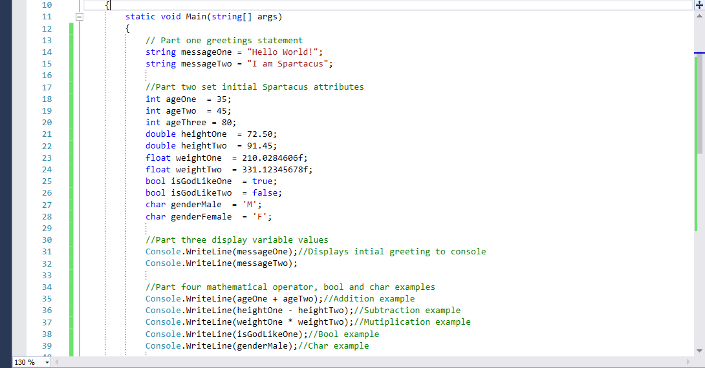</div>

!SLIDE

- Please make the following changes to your code

<div float="right"></div>

- Lets keep our Hello World program open.

## The wonderful world of strings

- We have learned so far how to display strings using two differant approaches.

- In part one of our Hello World program we used the following: string messageOne = "Hello World!";

- We then used the Console.WriteLine() method to display the variable <mark>messageOne</mark>. Console.WriteLine(messageOne)

- We also used the Console.WriteLine() method and directly referanced the string we wanted to display. Console.WriteLine("Hello World!")

- In the following slides we will learn two more approaches which will give you greater flexibility on how you configure your output.

## Nothing to do with cats

- We learned in a prior lesson about the <mark>+</mark> operator, and gave you some examples of its use.

- When we use the operator `+` with `string`s, we call this <mark>concatenation</mark>. 

- We are not adding strings as we would add numbers, but we are appending one `string` to another, resulting in a longer `string`. 

- C# knows how to turn characters into strings, so it does that for us behind the scenes, saving us a bit of work. 

- Lets do an experiment

- Volunteer time

!SLIDE

- Make the following additions or changes to your code:

- Highlight parts two through seven of our Hello World code.

- Select the <mark>Comment out selected lines</mark> tool highlighted on the standard tool bar as shown in the pic below.

<div float="right">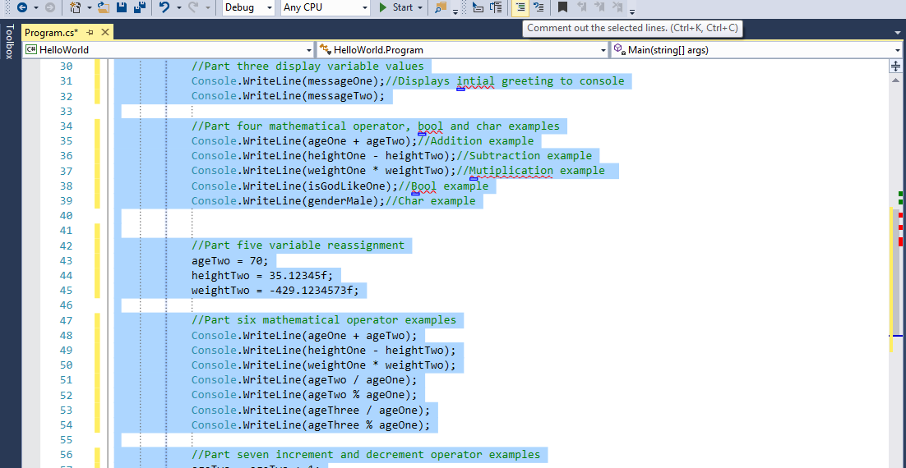</div>

<div class="fragment">
Question time: Any quesses what the console will show when we execute our code?
</div>


## We should all be here

<div float="right">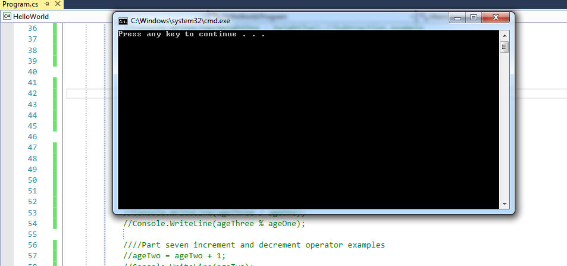</div>

- Commenting code tells Visual Studio to ignore that code for execution.

- So when we executed our code our console was blank.

- Commenting code is very important for documenting and troubleshooting.

!SLIDE

- Make the following changes and additions to your code.

- Place this code below part seven of your code.

```C#
//Part eight concatenation example
Console.WriteLine(messageOne + " " + messageTwo + "."); 
```
<div class="fragment">
Question time: Any quesses what the console will show when we execute our code?
</div>

<div class="fragment">
Lets have two volunteers come up and write on the whiteboard what they think the output will show.
</div>

<div class="fragment">
Ok run your program and lets see if we are right.
</div>

## We should all be here

<div float="right">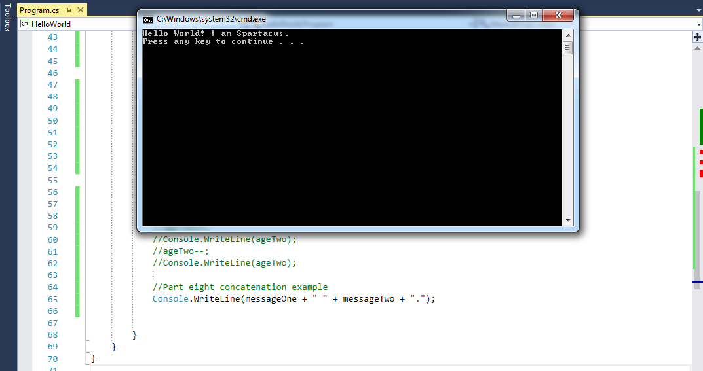</div>

- We used two variables and two string literals and came up with a nice looking sentence.

- The use of spaces will be very important when formatting output.

## Pair programming time

- I would like you to add the following sentences below our last line of code in part eight.

- I need two volunteers to write their solutions on the whiteboard. 

- Convert these sentences to code.

- <mark>I am 35 years old, and yes it's true I am godlike.</mark>

- <mark>I weigh around 210 pounds, and I am around 72 inches tall.</mark>

- Once you have completed the exercise, execute your code.

## We whould all be here

<div float="right">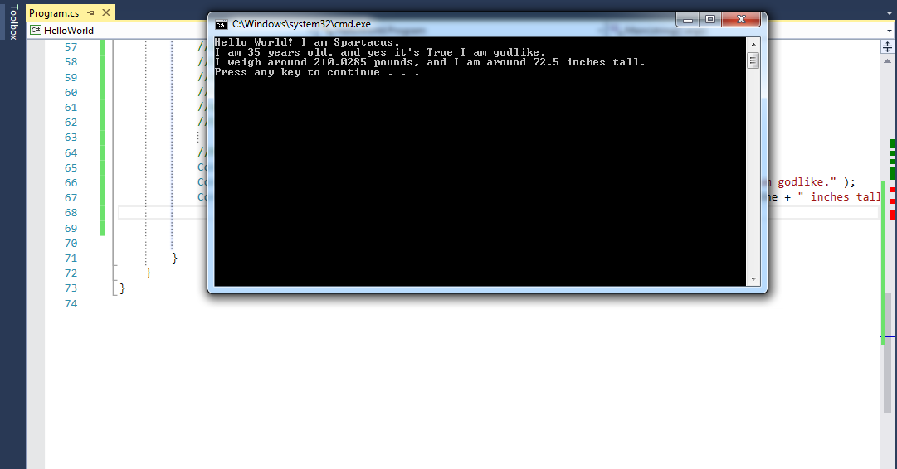</div>

- Did you get the same output? If not why?

## Please make sure your code is the same as the code below.

<div float="right">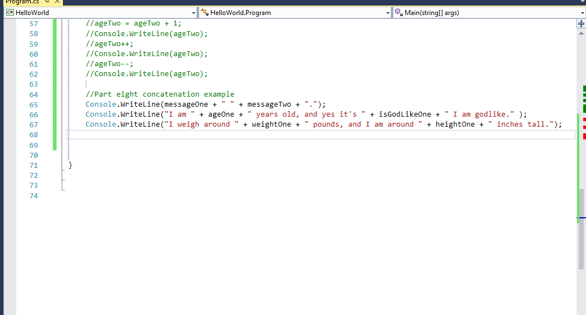</div>

- Remember to pay attention to the spaces before and after our string literals.

## Option Options Options to many Options

- Yet another way to concatenate a string is to use indexing.

- In a future lesson we will cover arrays and indexing.

- For our purposes in this lesson, it is important to note indexes in Computer Science start with <mark>0</mark>.

- So if I wrote the following sentence: <mark>I am 35 years old, and yes it's true I am godlike.</mark>.

- We know we need two variables to construct the sentence. We chose <mark>ageOne</mark> and <mark>isGodLike</mark>.

- Now lets use indexing to construct our output.
  
!SLIDE

- Volunteer time

- I would like you to add the following sentences below our last line of code in part eight.

```C#
Console.WriteLine("My father is {0} years old, and yes it's {1} he is a god.", ageThree, isGodLikeOne);
```
- Notice the entire sentence is enclosed in <mark>quotes</mark>, but we have included <mark>{0}</mark> and <mark>{1}</mark>.

- These two values are called <mark>indexes</mark>, and they referance the postions of the two vaiables <mark>ageOne, isGodLikeOne</mark>.

- <mark>ageThree</mark> is in the <mark>0</mark> position and <mark>isGodLikeOne</mark> is in the <mark>1</mark> position.

<div class="fragment">
Question time: What would be the value of the index, If we added a third vaiable at the end of the sentence?
</div>

## Pair programming time

- I would like you to add the following sentences below our last line of code in part eight.

- I need two volunteers to write their solutions on the whiteboard. 

- Convert these sentences to code using indexing.

- <mark>I am 35 years old, and yes it's true I am godlike.</mark>

- <mark>I weigh around 210 pounds, and I am around 72 inches tall.</mark>

- Once you have completed the exercise, execute your code.

## We whould all be here

<div float="right">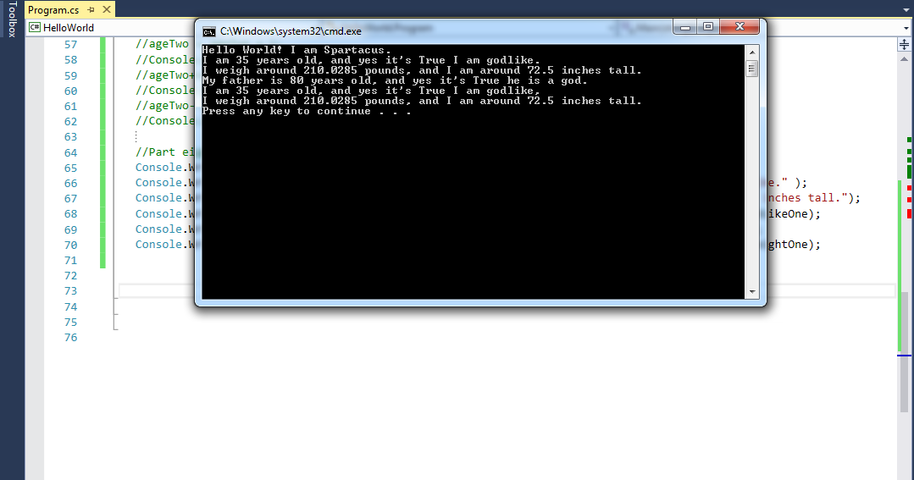</div>

- Did you get the same output? If not why?

## Please make sure your code is the same as the code below.

<div float="right">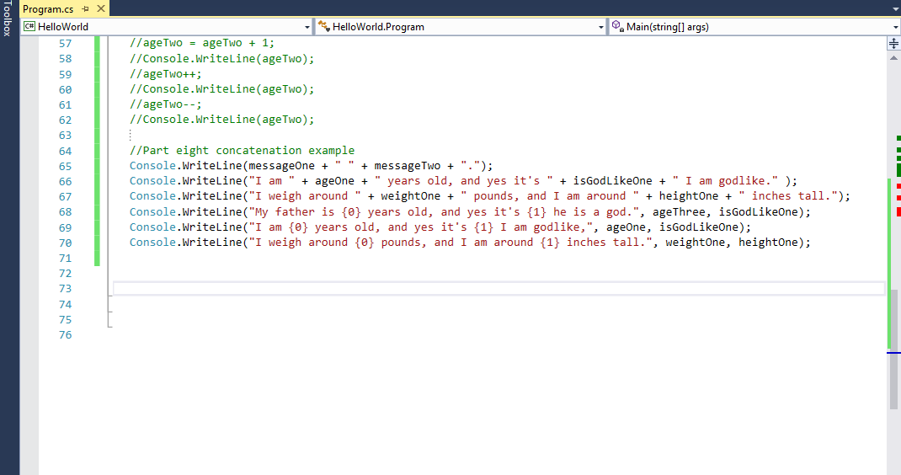</div>


## strings are Objects

- What operator do we use When we want to check for equality between value type variables?

<div class="fragment">
Remember the following: Console.WriteLine(5 == 5)
</div>

<div class="fragment">
When we compare objects like strings, we use the equals method.
</div>

<div class="fragment">
We will use our code to give us two examples.
</div>

## Lets experiment

- Volunteer time

- Please comment out part eight.

- I would like you to add the following sentences below our last line of code in part eight.

<mark>//Part nine string equality examples</mark>

<mark>Console.WriteLine(messageTwo.Equals(messageOne));</mark>

<mark>Console.WriteLine(messageTwo.Equals("I am Spartacus"));</mark>

## We should all be here

<div float="right">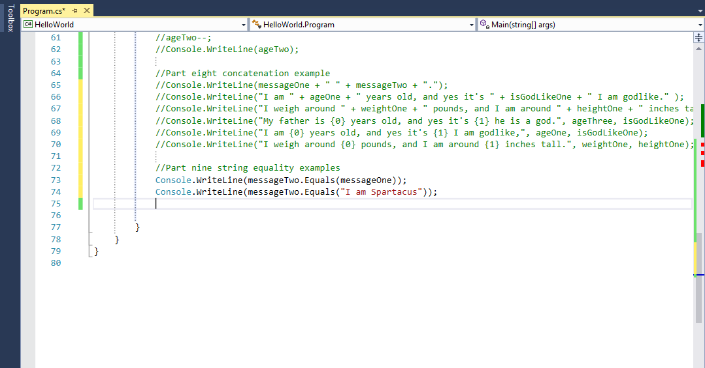</div>

<div class="fragment">
Question time: Before we execute our program, can anyone guess what values will be returned? Why?
</div>

<div class="fragment">
Now lets execute our program.
</div>

## We should all be here

<div float="right">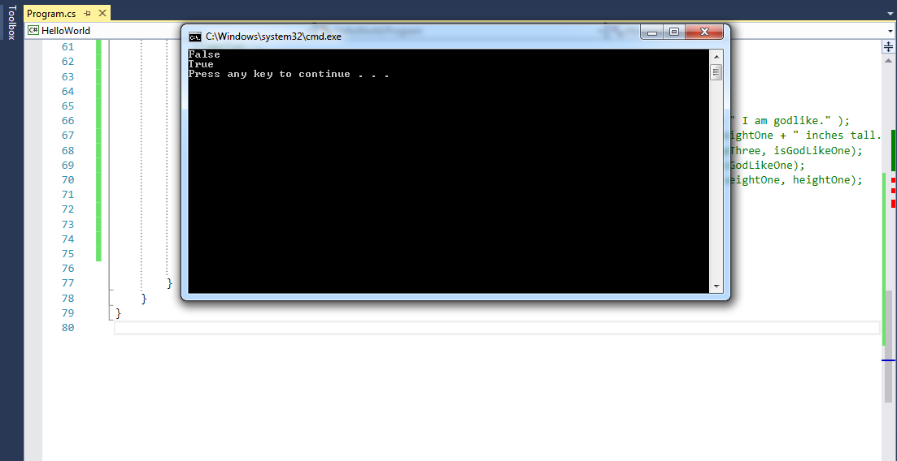</div>

- Looking at our results, we can tell the equals method returns a bool value.

- In later lessons, we will learn to use the <mark>equals</mark> method to facilitate the decision making process in our program.

- In the following slides we will cover some methods we can use with strings that you may find extremely valueable in the near future. <mark>Hint</mark> <mark>Hint</mark>

## Just in Case

- Methods we call on strings create and *return* new strings rather than changing the original string.
 
- Strings in C# are *immutable* meaning the value of the string cannot be changed after initialization.
 
- In upcoming projects and exercises, you my find it useful to convert a string to all uppercase or all lowercase.

- Lets look at an example of how to accomplish such a feat.

```C#
string myGreeting = "Hello";
Console.WriteLine(myGreeting.toUpperCase()); // prints "HELLO"
Console.WriteLine(myGreeting.toLowerCase()); // prints "hello"
Console.WriteLine(myGreeting); // prints "Hello"
```
<div class="fragment">
Question time: When do you think it would be wise to change the case of a word when writing code?
</div>

<div class="fragment">
Lets look at an example.
</div>

## Sensitivity Training

- We often use one of these methods to normalize user input. 

- Say we're asking for a color and call the `toLower()` method on the user's response.

- Before comparing the user input to "red", the user can type "RED", "Red", or "red" and it won't matter.

```C#

Console.WriteLine("Enter a color, please.")
string response = Console.ReadLine();

if(response.toLower().equals("red")) {
  Console.WriteLine("Roses can be red. Also, lilies.");
}
```
- Wait a minute what is this tomfoolery? We havent discussed <mark>string response = Console.ReadLine();</mark> before?

- Well we will cover this in more detail at a later time.

- Essentially we are telling our program to take input from the console and save that input as a string to the variable called <mark>response</mark>.

## Length

- As we will soon learn, aquiring the length of a string, as well as, other data structures will be very important. 

- We already know a string is just a collection of characters.

- C# provides a method called `length` which will tell us how many characters a string contains.

- Lets do and experiment.

- Volunteer time. 


!SLIDE

- Lets make the following changes and additions to our code.

- Comment out part nine of our Hello World code.

- Add the following code
 
```C#
//Part ten string length examples
int messOneLength = messageOne.Length;
int messTwoLength = messageTwo.Length;

Console.WriteLine("The length of messageOne is " + messageOne.Length);
Console.WriteLine("The length of messageTwo is " + messageTwo.Length);
Console.WriteLine("The length of messageOne is " + messOneLength);
Console.WriteLine("The length of messageTwo is " + messTwoLength);
```

## We should all be here

<div float="right">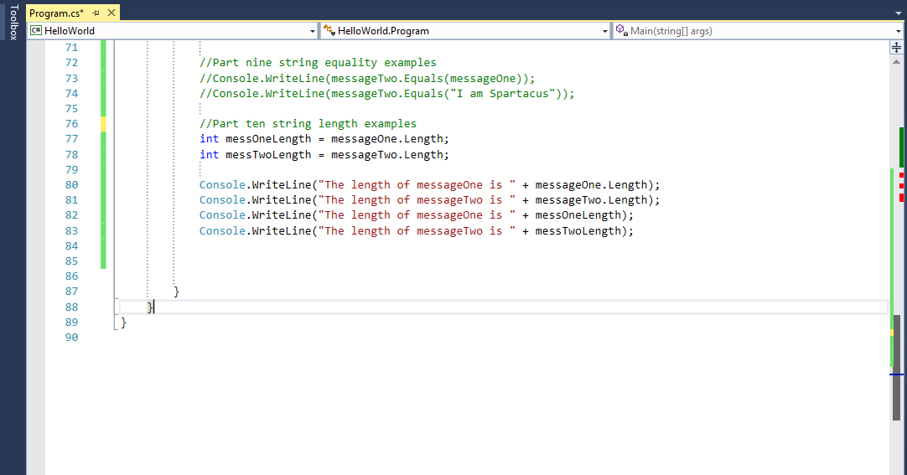</div>

<div class="fragment">
Question time: What values do you think will returned for messageOne.Length and messageTwo.Length
</div>

<div class="fragment">
Question time: What is the differance between the first two Console.WriteLines and the second two?
</div>

- Lets execute our program and see if we get the results we anticipated.

## We should all be here

<div float="right">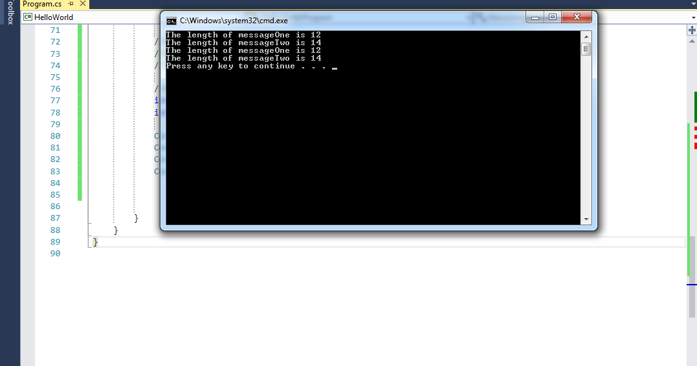</div>

- Now lets talk about our results

<div class="fragment">
Question time: Any quesses why we received these results? 
</div>

<div class="fragment">
Question time: We assigned the length values to variables. Why couldn't add those two values together or perfom other mathimatical operations?
</div>

## Escape!

- Sometimes we need special characters in strings. 

- The obvious example is a quotation mark. 

- Quotation marks are what open and close strings, so how would we include a quotation mark in a string? 

- We do something called *escaping*. We refer to the backslash (`\`) we use as an *escape character*.

```C#
Console.WriteLine("Phil said, \"You've got red on you\".");
```

We can also use escaping to insert special characters like newlines (`\n`) and tabs (`\t`):

```C#
Console.WriteLine("This is the first line.\nSecond line");
Console.WriteLine("\tThis line is indented.");
```

## Other Useful Methods

method	|description|example|result
------	|-----------|-------|------
`trim`|trims the whitespace from the beginning and end of a `string`; useful for cleaning up user input|`" bar  ".trim()`|`"bar"`
`indexOf`|returns the index of the first occurence of a substring in this `string`|`"foo bar baz".indexOf("bar")`|`4`
`contains`|indicates whether this `string` contains a substring|`"foobarbaz".contains("ba")`|`true`
`startsWith`|indicates whether this `string` starts with another|`"foo".startsWith("f")`|`true`
`endsWith`|indicates whether this `string` ends with another|`"baz".endsWith("az")`|`true`
`substring`|returns a substring starting at the specified index, optionally including an end index|`"hello".substring(1)`<br />`"hello".substring(1, 4)`|`"ello"`<br/>`"ell"`

Try [C# Sharp string 43 exercises with solution](https://www.w3resource.com/csharp-exercises/string/index.php)